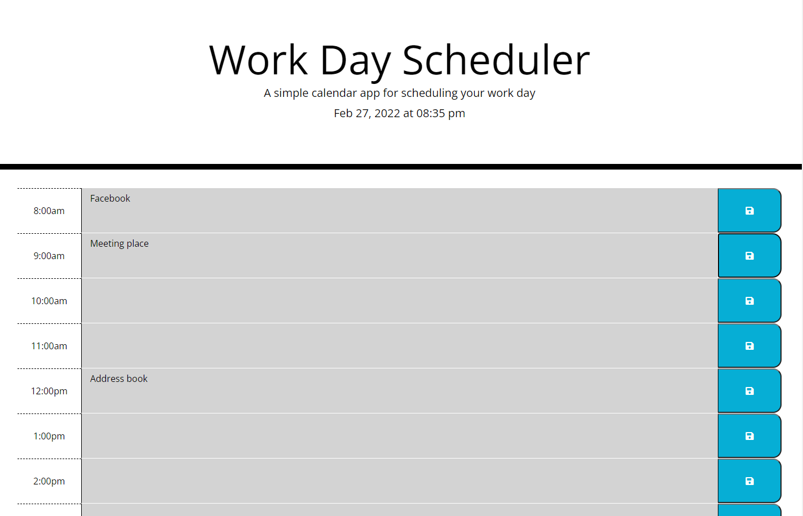

# Homework5-Work-Day-Scheduler

For the work-day scheduler, I want to add important events into a daily planner so that i can manage my time

When i use the daily planner to create a schedule, I am able to see the current day and time  displayed at the top of the schedule

When I scroll down, I am given a list of hours available in a given work day

Each time block will be color coded. Grey will be past hour blocks. Green will be future hour blocks. And Red will be the current hour block.

When I click into any hour block, I am presented with a text area that I can populate that area with text that I can then save using a button with the floppy-disk save icon

When I refresh the page, the info persists in the correct time block until I save another event in that text-area.

